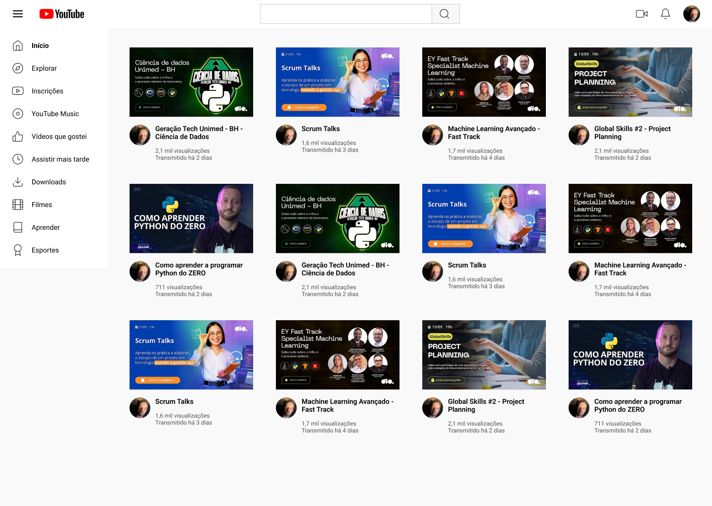

<h1 align="center">CLONE YOUTUBE</h1>

O clone do YouTube é um projeto desenvolvido com base no design do Figma fornecido pela Dio.

Este projeto tem como objetivo colocar em prática e aperfeiçoar as técnicas de flexbox e display grid do CSS.

  <a href="#-tecnologias">Tecnologias</a>&nbsp;&nbsp;&nbsp;|&nbsp;&nbsp;&nbsp;
  <a href="#-layout">Layout</a>&nbsp;&nbsp;&nbsp;|&nbsp;&nbsp;&nbsp;
  <a href="#-protótipo">Protótipo</a>

 

  

## 🚀 Tecnologias

Esse projeto foi desenvolvido com as seguintes tecnologias:

- HTML e CSS
- Git e Github
- Figma

## 🔖 Layout

Você pode visualizar o layout do projeto através [DESSE LINK](https://www.figma.com/design/WiI3krqI6oLa3Dxc8aG009/Desafio-de-Flexbox---DIO-(Copy)?node-id=1-2&t=ycWGZrf6i9W1OXbE-1) ou o protótipo [NESTE LINK](https://www.figma.com/proto/WiI3krqI6oLa3Dxc8aG009/Desafio-de-Flexbox---DIO-(Copy)?node-id=1-2&node-type=frame&t=ycWGZrf6i9W1OXbE-0&scaling=min-zoom&content-scaling=fixed&page-id=0%3A1). É necessário ter conta no [Figma](https://figma.com) para acessá-lo.

## 🖥 Protótipo

Você pode visualizar o protótipo web através [DESSE LINK](https://thiagogreiner.github.io/Clone_Youtube/))
